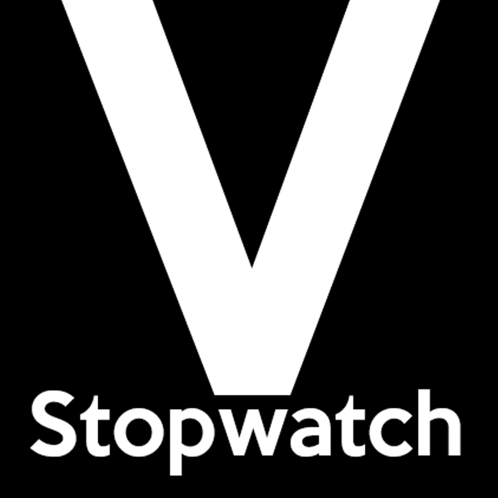

# VStopwatch
**Version 1.0.0**

<p align="center">
  
</p>

Simple cross-platform stopwatch made with React Native.

## Table of Contents
* [Getting Started](#getting-started)
* [Requirements](#requirements)
* [Installing](#installing)
* [Overview](#overview)
* [Download](#download)
* [Built With](#built-with)
* [Author](#author)
* [License](#license)

## Getting Started
These instructions will get you a copy of the project up and running on your local machine for development and testing purposes.

## Requirements 
* [Node.js LTS release](https://nodejs.org/en/) or greater
* [Git](https://git-scm.com/)
* [Watchman](https://facebook.github.io/watchman/docs/install#buildinstall) for macOS users
* [Expo CLI](https://docs.expo.io/get-started/installation/)

## Installing
Run the following commands and you will end up with a local running version of the project.

```bash
$ git clone https://github.com/jonathasgouv/vstopwatch.git
$ cd vstopwatch/
$ npm install
$ expo start
```

## Overview
VStopwatch is built with a lap system. Besides that, you can stop and resume the timer whenever you want. 

It also highlights your best and worst laps, so you can keep track of your performance.

<p align="center">
  
</p>

## Download
* [Version 1.0.0](builds/VStopwatch-8b2cdfa2b49f4880a6194f3342762a78-signed.apk)

## Built With
* [Javascript](https://www.javascript.com/)
* [Node.js](https://nodejs.org/en/)
* [React Native](https://reactnative.dev/)

## Author
* [Jônathas Gouveia](https://github.com/jonathasgouv/)

## License
This project is licensed under the  GPL-3.0 License - see the [LICENSE](https://github.com/jonathasgouv/vstopwatch/blob/master/LICENSE) file for details